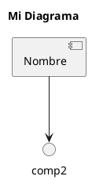

# 📊 Documentación de Diagramas - CalculadoraTerminal

## Introducción
Este directorio contiene diagramas PlantUML que documentan la arquitectura, flujo de procesos y estructura del proyecto **CalculadoraTerminal**.

Los diagramas se renderizan automáticamente en GitHub sin necesidad de instalación adicional.

---

## 📋 Diagramas Disponibles

### 1. 🏗️ Arquitectura General (`arquitectura.puml`)
**Propósito:** Mostrar los componentes principales y cómo interactúan entre sí.

**Componentes visualizados:**
- **Sistema de Entrada**: Captura los valores del usuario
- **Sistema de Validación**: Verifica que los datos sean correctos
- **Motor de Cálculo**: Ejecuta la operación matemática
- **Sistema de Salida**: Presenta el resultado al usuario
- **Manejo de Errores**: Gestiona excepciones sin interrumpir el programa

**Casos de uso:**
- Entender la estructura general del proyecto
- Identificar dónde ocurren las validaciones
- Ver cómo fluyen los datos entre componentes

---

### 2. 🔄 Flujo de Operaciones (`flujo_operaciones.puml`)
**Propósito:** Diagrama de actividad que muestra el proceso paso a paso.

**Flujo principal:**
1. Solicitar primer número (num1)
2. Validar que sea numérico
3. Solicitar operador (+, -, *, /)
4. Validar que sea operador válido
5. Solicitar segundo número (num2)
6. Validar que sea numérico
7. Verificar si es división por cero
8. Ejecutar operación
9. Mostrar resultado
10. Preguntar si continuar

**Decisiones clave:**
- Validación de cada entrada
- Detección de división por cero
- Loop para reintentos en caso de error

**Casos de uso:**
- Seguimiento del flujo de control
- Identificar puntos de validación
- Entender cómo se manejan los errores

---

### 3. 🏛️ Estructura de Componentes (`estructura_clases.puml`)
**Propósito:** Mostrar clases, métodos y relaciones entre componentes.

**Componentes:**

#### Clase: `Calculadora`
```
Atributos:
- num1: float
- num2: float
- operacion: str
- resultado: float

Métodos:
- ejecutar(): void
- obtener_resultado(): float
```

#### Clase: `Validador`
```
Atributos:
- modo_debug: bool

Métodos:
- validar_numero(valor): bool
- validar_operador(op): bool
- es_division_valida(divisor): bool
```

#### Clase: `ManejoErrores`
```
Atributos:
- error_actual: str
- codigo_error: int

Métodos:
- registrar_error(mensaje): void
- mostrar_error_usuario(mensaje): void
- mostrar_traza_debug(): void
```

#### Clase: `Salida`
```
Atributos:
- color_resultado: str

Métodos:
- mostrar_resultado(valor): void
- mostrar_error(mensaje): void
- mostrar_menu(): void
```

**Relaciones:**
- `Calculadora` usa `Validador`, `ManejoErrores` y `Salida`
- `ManejoErrores` usa `Salida` para mostrar errores

**Casos de uso:**
- Entender responsabilidades de cada componente
- Identificar métodos disponibles
- Ver cómo se relacionan las clases

---

### 4. 👥 Casos de Uso (`casos_uso.puml`)
**Propósito:** Mostrar la interacción desde la perspectiva del usuario.

**Actores:**
- **Usuario**: Persona que utiliza la calculadora

**Casos de Uso:**

| Caso | Descripción |
|------|-------------|
| **Realizar operación aritmética** | Caso de uso principal |
| **Ingresar números** | Parte de la operación principal |
| **Seleccionar operador** | Parte de la operación principal |
| **Ver resultado** | Resultado de la operación |
| **Manejar división por cero** | Error específico |
| **Manejar entrada inválida** | Validación de datos |
| **Activar modo debug** | Configuración opcional |

**Flujos:**
- El usuario realiza una operación básica
- Se validan los números
- Se valida el operador
- Se detectan errores como división por cero
- Se muestra el resultado o error

**Casos de uso:**
- Entender qué hace el sistema desde el punto de vista del usuario
- Identificar escenarios de error
- Planificar nuevas funcionalidades

---

## 🖥️ Formas de Visualizar los Diagramas

### Opción 1: GitHub (Recomendado - Automático)
✅ **La forma más fácil y directa**

1. Ve al repositorio en GitHub
2. Navega a `/docs/diagrams/`
3. Haz clic en cualquier archivo `.puml`
4. GitHub renderiza automáticamente el diagrama

**Ventajas:**
- Sin instalación
- Se actualiza con cada commit
- Compatible con todos los navegadores

---

### Opción 2: PlantUML Online
✅ **Acceso online sin instalación**

1. Ve a [PlantUML Online](http://www.plantuml.com/plantuml/uml/)
2. Abre un archivo `.puml` del repositorio (raw URL)
3. Copia y pega el contenido
4. Visualiza el diagrama

**URLs de archivos raw:**
```
https://raw.githubusercontent.com/yospinamurillo/CalculadoraTerminal/main/docs/diagrams/arquitectura.puml
https://raw.githubusercontent.com/yospinamurillo/CalculadoraTerminal/main/docs/diagrams/flujo_operaciones.puml
https://raw.githubusercontent.com/yospinamurillo/CalculadoraTerminal/main/docs/diagrams/estructura_clases.puml
https://raw.githubusercontent.com/yospinamurillo/CalculadoraTerminal/main/docs/diagrams/casos_uso.puml
```

---

### Opción 3: VS Code (Local)
✅ **Para desarrollo local**

**Requisitos:**
- VS Code instalado
- Extensión: "PlantUML" (por jebbs)

**Pasos:**
1. Instala la extensión desde: https://marketplace.visualstudio.com/items?itemName=jebbs.plantuml
2. Abre cualquier archivo `.puml`
3. Presiona `Alt + D` (Windows/Linux) o `Cmd + Option + D` (Mac)
4. Se abre el preview en tiempo real

**Ventajas:**
- Previsualización en tiempo real
- Edición y vista simultánea
- No requiere conexión a internet

---

### Opción 4: Draw.io Integration
✅ **Para editing visual avanzado**

1. Ve a [Draw.io Editor](https://www.draw.io/)
2. Abre desde URL o importa archivos
3. Edita visualmente
4. Exporta a PlantUML

**Nota:** Draw.io puede importar y exportar diagramas en formato PlantUML.

---

## 📝 Cómo Actualizar los Diagramas

### Desde VS Code:
```bash
# 1. Abre el archivo .puml
# 2. Edita el código PlantUML
# 3. Visualiza cambios con Alt + D
# 4. Guarda (Ctrl + S)
# 5. Commit y push a GitHub
```

### Sintaxis básica de PlantUML:


### Ejemplos de relaciones:
```
--> : relación normal
..-> : relación punteada
*--> : composición
-|> : herencia
```

---

## ✅ Checklist de Mantenimiento

- [ ] Actualizar diagramas si hay cambios en la arquitectura
- [ ] Revisar diagramas en cada PR que modifique la estructura
- [ ] Mantener la nomenclatura consistente entre diagramas
- [ ] Verificar que los diagramas se rendericen en GitHub después de cada commit
- [ ] Documentar nuevos componentes en los diagramas correspondientes
- [ ] Validar que la salida en GitHub sea legible

---

## 🔗 Referencias

- **Documentación PlantUML:** https://plantuml.com/es/
- **Guía de sintaxis:** https://plantuml.com/es/guide
- **GitHub Markdown + PlantUML:** https://docs.github.com/en/get-started/writing-on-github

---

## 📧 Preguntas o Sugerencias

Si tienes dudas sobre los diagramas o sugerencias de mejora, abre un issue en el repositorio.

**Última actualización:** 20 de Mayo, 2026
